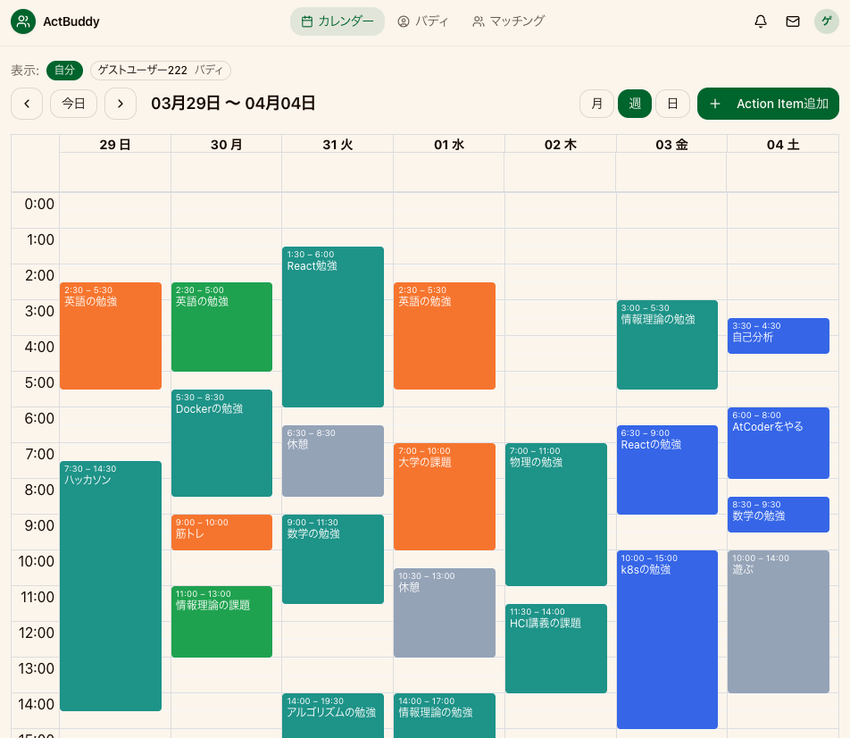

# ActBuddy

**意志ではなく「環境」で行動を引き出す。タイムブロッキング × バディ制の行動支援アプリ**


<!-- ここにデモGIF / ライブURLを貼る -->
<!--  -->
<!-- **Live Demo**: https://actbuddy.example.com -->

---

## 概要・解決する課題

**やるべきことがあるのに、行動できない。** 勉強や開発を進めたいのに、気づけばSNSやYouTubeに時間を溶かしてしまう——学生や若手エンジニアに向けたアプリです。

原因は意志の弱さではなく、**「次に何をやるかが曖昧」** で **「誘惑が多い環境にいる」** という2つの環境条件にあります。裏を返せば、**「見られている」**+**「やることが決まっている」** の2条件を満たせば人は動ける、ということです。

ActBuddy は、目標や活動時間が近いユーザー同士を1週間限定のバディとしてマッチングし、毎日のタイムブロッキングと進捗を共有し合うことでこの2条件を仕組み化。期間限定の関係性が程よい緊張感を生み、行動継続を後押しします。

---

## 主要機能

### バディマッチング

目標タイプ・活動時間帯をもとにスコアリングし、相性の良いバディを自動マッチング。1 時間ごとのバッチ処理で待機キューからペアを生成します。

<!-- ここにマッチング画面のスクショを貼る -->

### カレンダー & アクションアイテム管理

react-big-calendar ベースのカレンダー UI で、その日の行動を「何時から何時に何をやるか」とタイムブロックに登録。達成状況（未着手 → 30% → 70% → 完了）を段階的に入力でき、バディのカレンダーをフィルター表示で重ねて確認できます。「見られている」という意識が、行動の継続を後押しします。

<!-- ここにカレンダー画面のスクショを貼る -->



### リアルタイムチャット

Go の `gorilla/websocket` + Hub パターンで構築した**バディ間チャット**。マッチン
グ成立時にチャットルームが自動生成され、挨拶やもくもく会の日程調整など、バディの**初動コミュニケーション**をスムーズにします。

<!-- ここにチャット画面のスクショを貼る -->

### セッションベース認証（BaaS不使用）

Supabase / Firebase Auth などの BaaS に頼らず、Go でセッションベース認証をフルスクラッチ実装。パスワードは bcrypt でハッシュ化し、ランダム32バイトのトークンを sessions テーブルで管理。HttpOnly Cookie で配布し、Gin ミドルウェアで全保護ルートを認証チェックします。

---

## チーム開発の文脈

- **開発手法**: Issueドリブン開発
- **AI 開発支援**: CLAUDE.md によるプロジェクト構造・開発ルールの共有

---

## 技術スタック

| レイヤー                 | 技術                                                                 |
| ------------------------ | -------------------------------------------------------------------- |
| **フロントエンド**       | Next.js 16 (App Router) / React 19 / TypeScript                      |
| **スタイリング**         | Tailwind CSS v4 / shadcn/ui / Radix UI                               |
| **バックエンド**         | Go 1.25 / Gin / sqlx                                                 |
| **データベース**         | PostgreSQL 16                                                        |
| **リアルタイム通信**     | gorilla/websocket                                                    |
| **API ドキュメント**     | Swagger (swaggo)                                                     |
| **API クライアント生成** | @hey-api/openapi-ts                                                  |
| **インフラ**             | Docker Compose                                                       |
| **CI/CD**                | GitHub Actions (lint / format / vuln scan / Docker image scan)       |
| **コード品質**           | ESLint / Prettier / golangci-lint (gosec 含む) / govulncheck / Trivy |

---

## アーキテクチャ

```
  ┌─────────────────────────────────────────────┐
  │               Client (Browser)              │
  └──────────┬──────────────────┬───────────────┘
             │ HTTP (pages)     │ HTTP REST / WebSocket
             ▼                  ▼
  ┌──────────────────┐   ┌──────────────────────┐
  │  Next.js 16      │   │   Go / Gin           │
  │  Port 3000       │   │   Port 8080          │
  │                  │   │                      │
  │  App Router      │   │  Auth Middleware     │
  │  middleware.ts   │   │  Handler             │
  │  features/       │   │  Service             │
  └──────────────────┘   │  Repository          │
                         │                      │
                         │  WebSocket Hub       │
                         │  Matching Job        │
                         └──────────┬───────────┘
                                    │
                                    ▼
                         ┌──────────────────────┐
                         │   PostgreSQL 16      │
                         │   Port 5432          │
                         └──────────────────────┘
```

---

## ディレクトリ構成

```
actbuddy-proto/
  ├── frontend/                    # Next.js フロントエンド
  │   ├── src/
  │   │   ├── app/                 # App Router ページ
  │   │   │   ├── (app)/          # 認証済みユーザー向けルートグループ
  │   │   │   │   ├── dashboard/
  │   │   │   │   ├── calendar/
  │   │   │   │   ├── matching/
  │   │   │   │   ├── buddies/
  │   │   │   │   ├── chat/
  │   │   │   │   └── settings/
  │   │   │   └── (auth)/         # 未認証ユーザー向けルートグループ
  │   │   │       ├── login/
  │   │   │       └── signup/
  │   │   ├── features/            # 機能モジュール
  │   │   │   ├── auth/           #   認証（LoginForm, SignupForm）
  │   │   │   ├── buddies/        #   バディ管理（BuddyCard）
  │   │   │   ├── calendar/       #   カレンダー（CalendarView, ActionItemCard）
  │   │   │   ├── chat/           #   チャット（ChatWindow, useChat hook）
  │   │   │   ├── matching/       #   マッチング（MatchingMain, BuddyProfileForm）
  │   │   │   └── settings/       #   設定
  │   │   ├── components/          # 共有UIコンポーネント（shadcn/ui）
  │   │   ├── lib/                 # ユーティリティ
  │   │   └── types/               # グローバル型定義
  │   ├── package.json
  │   └── tsconfig.json
  ├── backend/                     # Go バックエンド
  │   ├── main.go                  # エントリーポイント（DI・ルーティング）
  │   ├── internal/
  │   │   ├── auth/               # 認証（signup, login, session管理）
  │   │   ├── buddy/              # バディ（プロフィール, マッチング, 関係管理）
  │   │   ├── task/               # アクションアイテム CRUD
  │   │   └── chat/               # チャット
  │   │       ├── room/           #   ルーム管理
  │   │       ├── message/        #   メッセージ管理
  │   │       └── websocket/      #   WebSocket Hub
  │   ├── db/migrations/           # DBマイグレーション
  │   ├── go.mod
  │   └── Dockerfile
  ├── docker-compose.yml           # 開発環境一括起動
  └── .github/workflows/           # CI設定
      ├── frontend-ci.yml
      ├── backend-ci.yml
      └── docker-scan.yml
```

---

## 🚀 Development Commands

## Prettier

### フォーマット実行（コミット前に実行してください）

```bash
cd frontend
pnpm run format
```

## 🐳 Docker Compose

### 🔰 初回起動（ビルド込み）

```bash
docker compose up --build
```

### 通常起動（ビルド不要）

```bash
docker compose up
```

### 停止

```bash
docker compose down
```

### 完全リセット（DBボリュームも削除）

```bash
docker compose down -v
```

## Frontend（Next.js）

### 開発サーバー起動（ローカルのみ）

```bash
cd frontend
pnpm install
pnpm run dev
```

# ポート一覧

| Service  | Port |
| -------- | ---- |
| Frontend | 3000 |
| Backend  | 8080 |
| Postgres | 5432 |
